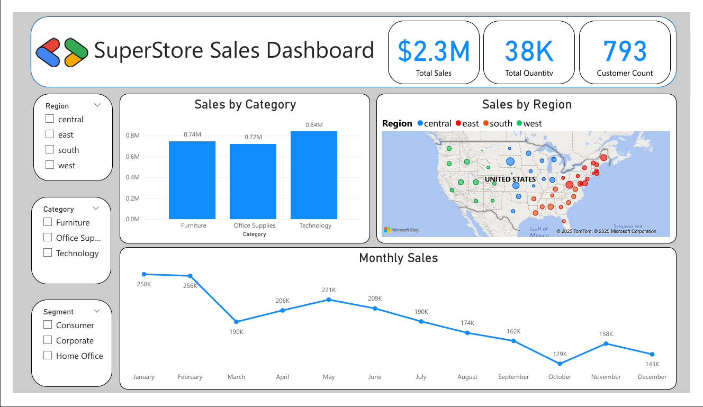

# 🛒 SuperStore Sales Dashboard

  
*(Power BI Dashboard Preview)*

---

## 📊 Project Overview
An interactive **Power BI Dashboard** built as my final capstone project in the Data Analysis Track with **GDG on Campus: CIC**.  
It transforms raw SuperStore data into actionable insights to support better business decisions.

---

## 📈 Key Insights
- 💰 **Total Sales:** $2.3M  
- 📦 **Total Quantity Sold:** 38K  
- 👥 **Customers:** 793  
- 🏆 **Top Region:** West  
- 💻 **Top Category:** Technology  

---

## 🛠️ Tools & Skills
- **Excel** → Data Cleaning & Preparation  
- **SQL** → Querying & Pre-processing  
- **Power BI** → Data Modeling, DAX, and Visualization  
- **Data Storytelling** → Turning raw numbers into insights  

---

## 🎯 Dashboard Features
- Sales & Profit breakdown by Region, Category, and Segment  
- Monthly sales trends and seasonal analysis  
- Top customers and discount impact visualization  
- Interactive filters for Region, Segment, and Time  

---

## 🚀 Learning Outcome
This project was not just about learning tools, but about adopting a **data-driven mindset**  
and building the ability to **tell a story through data**.  
It marks an important milestone in my journey as a data analyst.

---

## 💡 How to Use
1. Explore sales & profit across regions and categories.  
2. Analyze top-performing customers and products.  
3. Track monthly trends and seasonal patterns.  
4. Use interactive filters to focus on specific segments or regions.
